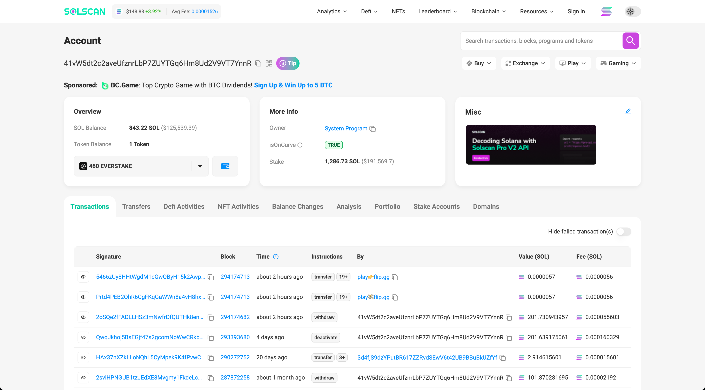
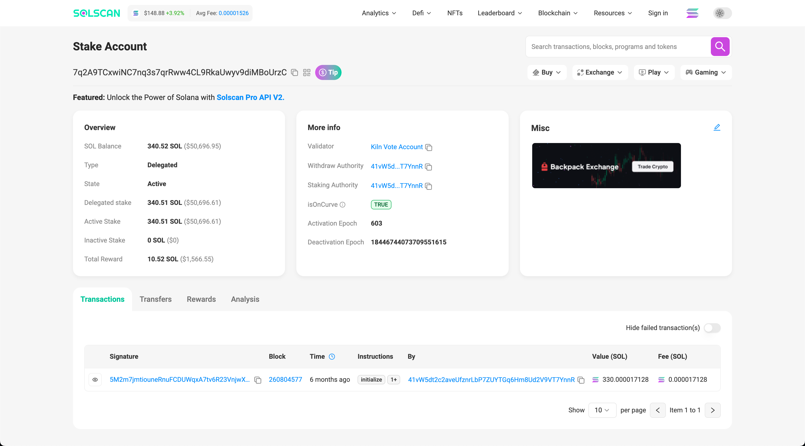

# SOL Balance Verifications

## Main Account Balance
src code: `getMainAccountBalance.ts`

result:
```shell: balance
Balance: 843.225380581 SOL
```
explorer:


## Stake Account Balance

### active stake account
src code: `getActiveStakeAccountBalance.ts`

result: 
```shell: balance
340.522277772
```
explorer:


### inactive stake account
src code: `getInactiveStakeAccountBalance.ts`

result:
```shell: balance
{ 
    context: { 
        apiVersion: '1.18.23', 
        slot: 294191661 
    }, 
    value: null 
}
```
→ value is null: all amount is undelegated and balance is null (this is collect)
